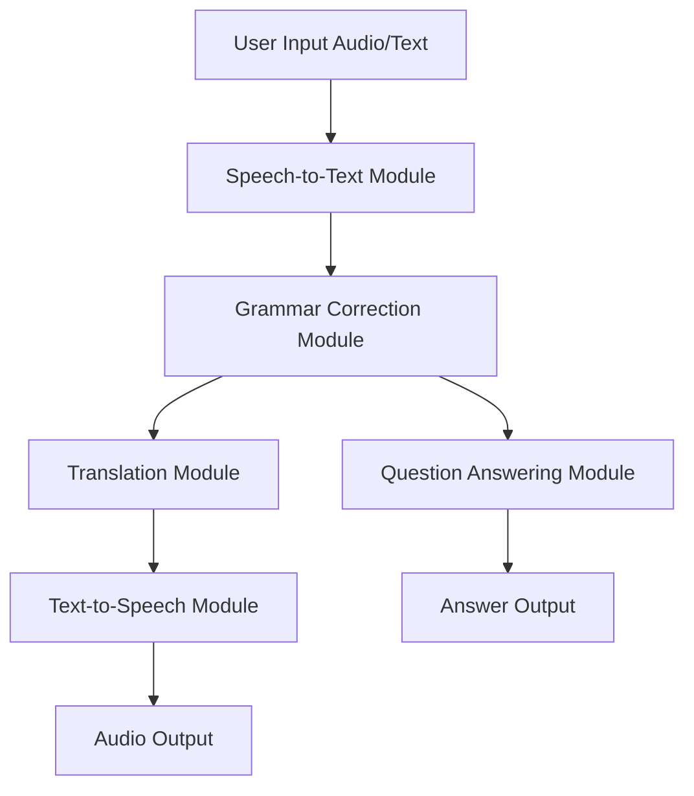

#  NLP Communication System using APIs

[](https://www.python.org/)
[](https://huggingface.co/)
[](https://pypi.org/project/SpeechRecognition/)
[](https://pypi.org/project/gTTS/)
[](https://pypi.org/project/deep-translator/)

A multi-functional **Natural Language Processing (NLP) system** that enables seamless communication by integrating multiple AI-powered APIs. The system supports **Speech-to-Text, Grammar Correction, Translation, Text-to-Speech, and Question Answering** — all in one intelligent pipeline.

---

##  Architecture




---

##  Key Features

*  Speech-to-Text (STT) using Google API
*  Grammar Correction using T5 Transformer
*  Multi-language Translation (Urdu, Arabic, French, etc.)
*  Text-to-Speech (TTS) using Google TTS
*  Question Answering using RoBERTa model
*  Modular API-based NLP pipeline

---

##  Technology Stack

* Python 3.10+
* speech_recognition
* deep_translator
* gTTS
* transformers (HuggingFace)
* vennify/t5-base-grammar-correction
* deepset/roberta-base-squad2

---

##System Modules

### 1️⃣ Speech-to-Text Module

* Converts audio into text
* Supports English (en-US) and Urdu (ur-PK)
* Uses Google Speech Recognition API
* Includes error handling

### 2️⃣ Grammar Correction Module

* Uses T5 Transformer model
* Improves grammar using prefix "grammar:"

### 3️⃣ Translation + TTS Module

* Translates text into target language
* Converts translated text into speech
* Uses temporary audio files

### 4️⃣ Question Answering Module

* Uses RoBERTa (SQuAD2)
* Extracts answers from context

---

##  Installation

```bash
git clone https://github.com/your-username/nlp-communication-system.git
cd nlp-communication-system
pip install -r requirements.txt
```

---

##  Usage

```bash
python core.py
```

---

##  Example Workflow

Input:
"he go to school yesterday"

Output:

* STT: "he go to school yesterday"
* Grammar: "He went to school yesterday."
* Translation (Urdu): "وہ کل اسکول گیا تھا"
* TTS: Audio file generated

---

##  Performance Insight

* Fast API-based processing
* High accuracy using pretrained models
* Modular and scalable design

---

##  Future Improvements

* Real-time microphone input
* Web app deployment (Flask / FastAPI)
* More language support
* Performance optimization

---

##  Project Structure

```
nlp-communication-system/
│
├── core.py
├── requirements.txt
├── README.md
└── temp_audio/
```

---

##  requirements.txt

```
speechrecognition
deep-translator
gtts
transformers
torch
```

---

##  GitHub Description

AI-powered NLP communication system with Speech-to-Text, Grammar Correction, Translation, Text-to-Speech, and Question Answering using Transformers and APIs.

---

##  GitHub Topics

nlp, speech-to-text, text-to-speech, translation, transformers, huggingface, python, ai, machine-learning

---

##  License

MIT License
